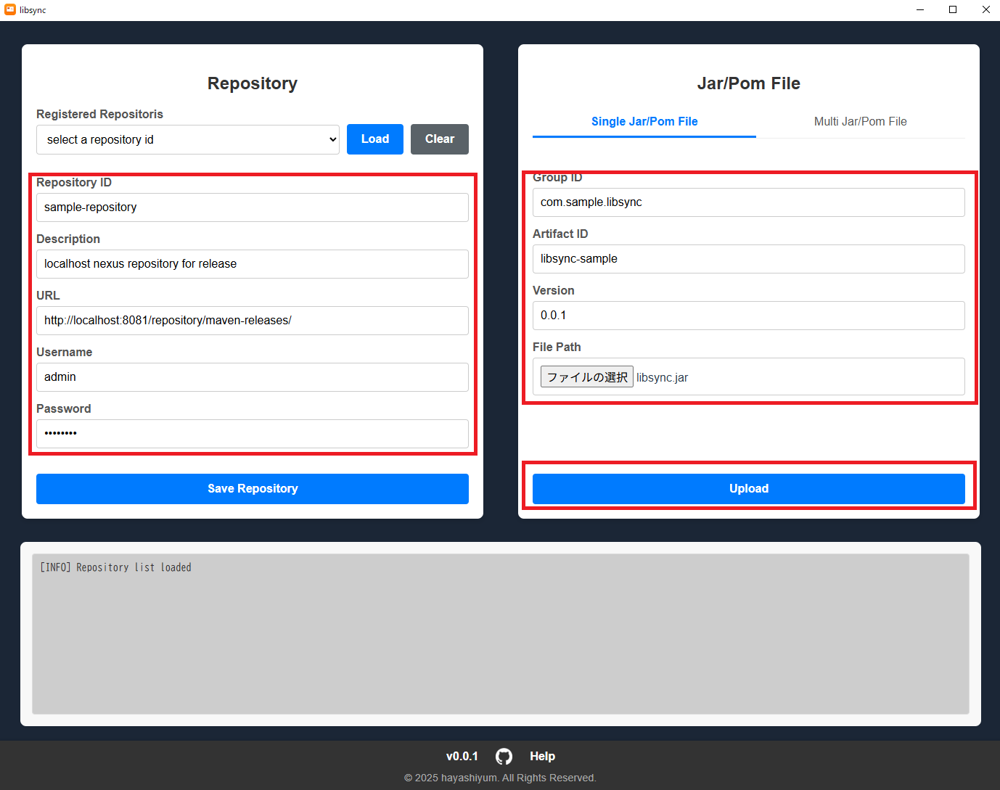
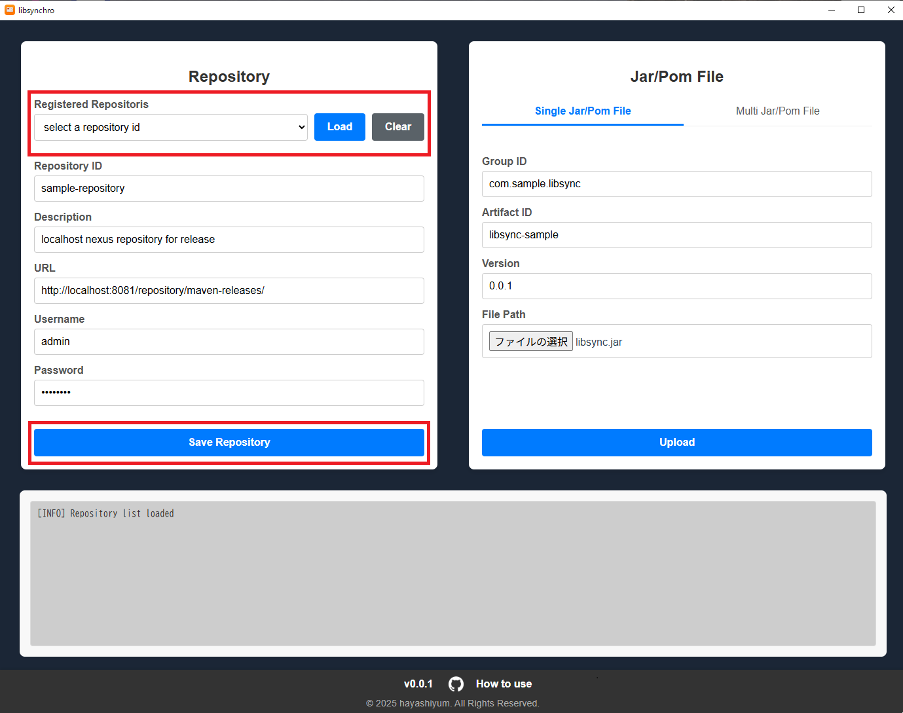
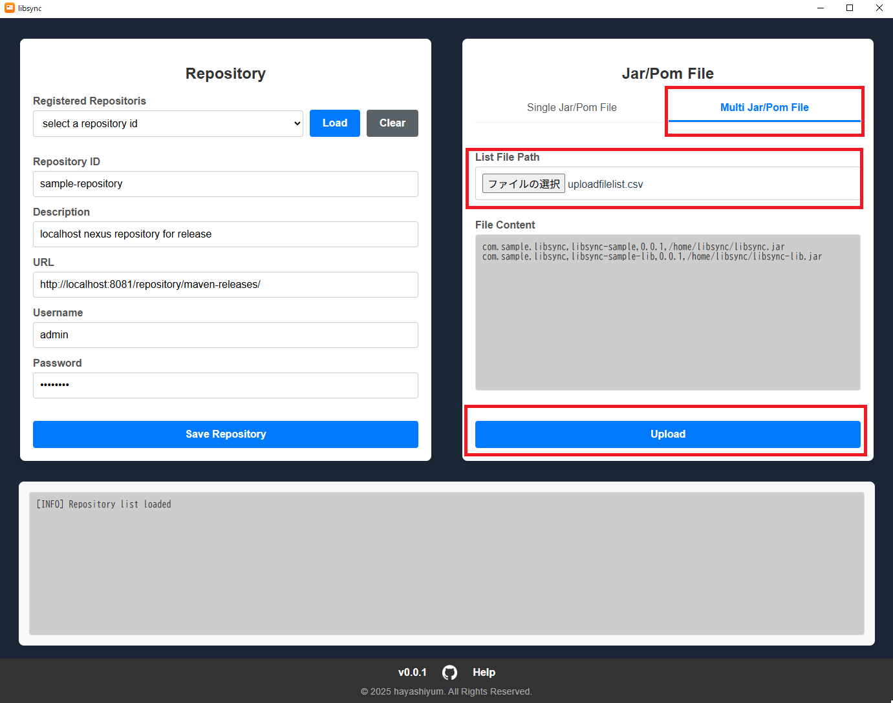

# libsynchro

libsynchro is a tool for registering files such as JAR and POM files in the Maven package format to a library management system like Nexus.
It allows for easy file uploads via a GUI.
It also provides features such as saving upload repository information and batch uploading multiple files.
File upload processing is handled by [Apache Maven](https://maven.apache.org/).

## Installation

### 1. Install Java and Maven

To upload files using libsynchro, you need to have Maven installed.
To run Maven, the Java Development Kit (JDK) must also be installed on your system.
Therefore, you should install both the JDK and Maven before proceeding with the libsynchro installation.

You can use any JDK distribution you prefer, such as Oracle or Amazon Corretto.
Please follow the specific installation instructions for your chosen distribution.

For Maven, follow the instructions on the official website:

* https://maven.apache.org/install.html


### 2. Download & run libsynchro

libsynchro is available on the following platforms:

* Windows (amd64)
* Windows (arm64)

Download the zip file for your platform from the GitHub [Releases](https://github.com/hayashiyum/libsynchro/releases) page. 
And extract the downloaded zip file and run libsynchro.

## How to use

Here are the main usage steps for libsynchro.

### 1. Upload single file

This is the basic procedure for uploading a single file.
First, enter the repository information in the fields of the **Repository**  panel.
Then, input the file information to be uploaded in the fields of the **Jar/Pom File** panel.
Finally, click the **Upload** button.



### 2. Save repository/Select saved repository

You can also save the destination repository information.
After entering the repository information in the Repository panel's fields, click the **Save Repository** button to register it.
You can then select and load a registered repository from **Registered Repositories**.



> [!CAUTION]
> The saved repository information is written to `<installation path>/config/repository-list.json`.
> Passwords are saved in plain text, so handle them with care.


### 3. Upload multiple files

You can also upload multiple files at once.
Create an upload list file and add the file information, separated by commas.
The entry order is `<GroupID>,<ArtifactID>,<Version>,<FilePath>`.
**Also, `<FilePath>` must be an absolute path**.
Below is an example of an entry.

```sample.csv
com.sample.libsynchro,libsynchro-sample,0.0.1,/home/libsynchro/libsynchro.jar
com.sample.libsynchro,libsynchro-sample-lib,0.0.1,/home/libsynchro/libsynchro-lib.jar
```

Select **Multi Jar/Pom File** in the tab, and then specify the upload file list from **Select File**.
Clicking the **Upload** button will start the upload process.



### 4. Maven configuration

If Maven configuration is required, edit `<installation path>/config/libsynchro-settings.xml`.
When using the tool in a proxy environment, add proxy settings to `libsynchro-settings.xml`.
The notation is the same as Maven's `settings.xml`.

Below is an example of a proxy configuration.

```xml
  <proxies>
    <proxy>
      <id>http-proxy</id>
      <active>true</active>
      <protocol>http</protocol>
      <username>proxyuser</username>
      <password>proxypass</password>
      <host>127.0.0.1</host>
      <port>8080</port>
      <nonProxyHosts>nonProxyHosts</nonProxyHosts>
    </proxy>
    <proxy>
      <id>https-proxy</id>
      <active>true</active>
      <protocol>https</protocol>
      <username>proxyuser</username>
      <password>proxypass</password>
      <host>127.0.0.1</host>
      <port>8080</port>
      <nonProxyHosts>nonProxyHosts</nonProxyHosts>
    </proxy>
  </proxies>
```